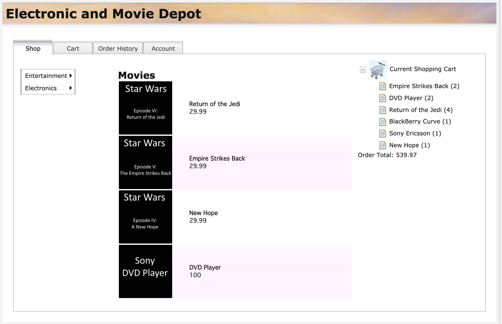
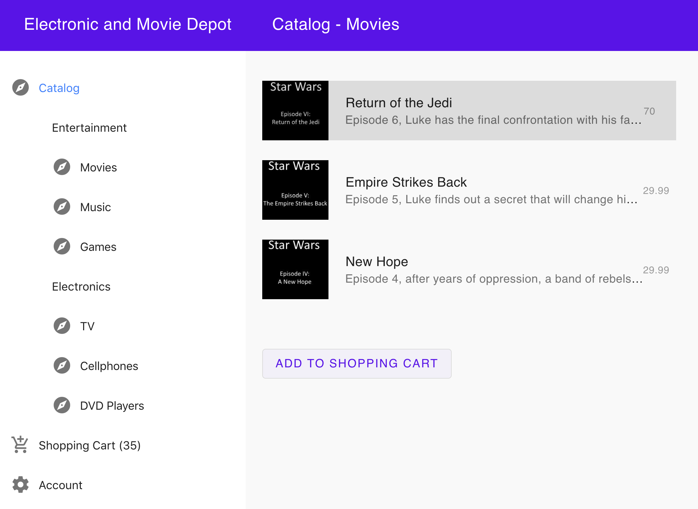
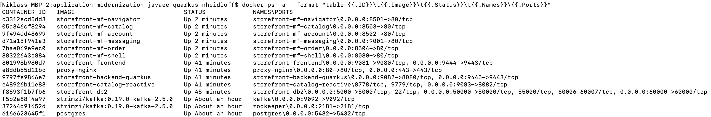
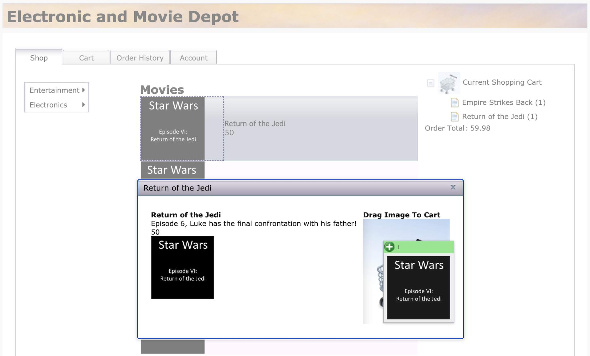
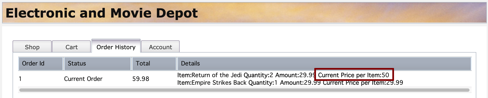

## Application Modernization Sample - From Java EE (2008) to Quarkus (2021)

Application modernization is done in multiple steps. This sample demonstrates how to modernize 12+ years old Java EE applications with cloud-native technologies like Quarkus and Open Liberty.

1. Monolith - WebSphere Traditional 8.5.5
    - Starting point: Java EE app from 2008 running in VM or bare metal
    - Db2 is used as data store
2. Monolith - WebSphere Traditional 9 in container
    - Application converted with Transformation Advisor
3. Monolith - WebSphere Liberty (latest)
    - Application converted with Transformation Advisor
    - Same project structure and EJBs
4. Separated Frontend - WebSphere Liberty (latest)
    - Dojo frontend in separate container
    - Backend and frontend connected via proxy
5. Separated Frontend - Open Liberty (latest)
    - Still same project structure and EJBs
6. Strangled Catalog Service and remaining Open Liberty Monolith
    - Strangled catalog service
        - Developed with Quarkus
        - Runs in JVM
        - Data is accessed in Postgres via Panache
        - Kafka events are sent when prices change (CQRS)
    - Remaining Open Liberty monolith
        - Modern project structure and CDI
        - Receives Kafka events when prices change (CQRS)
7. Strangled Catalog Service and remaining Quarkus Monolith
    - Strangled Quarkus catalog service 
        - Reactive endpoints and Postgres access
    - Remaining Quarkus monolith
        - Synchronous code
        - Runs as native executable
8. Micro frontend based web application
    - Developed with single-spa and Vue.js
    - Split in six containers
    - Messaging done via RxJS

Screenshot of legacy storefront application:

<kbd></kbd>

Screenshot of modernized storefront application:

<kbd></kbd>


### TL;DR

If you want to run the modernized application locally, you can invoke the following commands. All you need is a local Docker installation and the git CLI.

Notes:
* Docker requires 12 GB memory and 8 CPUs
* It takes roughly 10 minutes to start everything

```
$ git clone https://github.com/nheidloff/application-modernization-javaee-quarkus.git && cd application-modernization-javaee-quarkus
$ ROOT_FOLDER=$(pwd)
$ sh ${ROOT_FOLDER}/scripts-docker/build-and-run.sh
```

The 'build-and-run.sh' script will launch the following containers.

<kbd></kbd>

Once everything has been started, you can open the web applications:

* Legacy Dojo frontend: http://localhost/CustomerOrderServicesWeb
* Modern micro-frontend based application: http://localhost:8080

Add the item "Return of the Jedi" to the shopping cart via drag and drop.

<kbd></kbd>

Update the price of this item:

```
$ curl -X PUT "http://localhost/CustomerOrderServicesWeb/jaxrs/Product/1" -H "accept: application/json" -H "Content-Type: application/json" -d "{\"id\":1, \"price\":50}"
```

Open the "Order History" tab to see the updated price. The new price has been updated in the catalog service and the remaining monolith.

<kbd></kbd>


### Monolith - WebSphere Liberty

```
$ git clone https://github.com/nheidloff/application-modernization-javaee-quarkus.git && cd application-modernization-javaee-quarkus
$ ROOT_FOLDER=$(pwd)
$ sh ${ROOT_FOLDER}/scripts-docker/build-and-run-monolith-db2.sh
$ sh ${ROOT_FOLDER}/scripts-docker/build-and-run-monolith-app.sh
```

Open http://localhost/CustomerOrderServicesWeb


### Separated Frontend - WebSphere Liberty

```
$ git clone https://github.com/nheidloff/application-modernization-javaee-quarkus.git && cd application-modernization-javaee-quarkus
$ ROOT_FOLDER=$(pwd)
$ sh ${ROOT_FOLDER}/scripts-docker/build-and-run-monolith-db2.sh
$ sh ${ROOT_FOLDER}/scripts-docker/build-and-run-splitted-frontend.sh
```

Open http://localhost/CustomerOrderServicesWeb


### Separated Frontend - Open Liberty (EJB)

```
$ git clone https://github.com/nheidloff/application-modernization-javaee-quarkus.git && cd application-modernization-javaee-quarkus
$ ROOT_FOLDER=$(pwd)
$ sh ${ROOT_FOLDER}/scripts-docker/build-and-run-monolith-db2.sh
$ sh ${ROOT_FOLDER}/scripts-docker/build-and-run-splitted-frontend-open.sh
```

Open http://localhost/CustomerOrderServicesWeb


### Strangled Catalog Service with Open Liberty (CDI)

```
$ git clone https://github.com/nheidloff/application-modernization-javaee-quarkus.git && cd application-modernization-javaee-quarkus
$ ROOT_FOLDER=$(pwd)
$ sh ${ROOT_FOLDER}/scripts-docker/build-and-run-monolith-db2.sh
$ sh ${ROOT_FOLDER}/scripts-docker/run-database-postgres-catalog.sh
$ sh ${ROOT_FOLDER}/scripts-docker/run-kafka.sh
$ sh ${ROOT_FOLDER}/scripts-docker/build-and-run-catalog.sh
```

Open http://localhost/CustomerOrderServicesWeb

Add the item "Return of the Jedi" to the shopping cart and update the price.


*Local Development - Catalog*

Change the Postgres and Kafka URLs in application.properties. Plus change KAFKA_ADVERTISED_LISTENERS in docker-compose-kafka.yml.

```
$ cd catalog
$ mvn quarkus:dev
```

*Local Development - Open Liberty (CDI)*

Change the Kafka URL in microprofile-config.properties. Change database host and driver location in server.xml.

```
$ cd monolith-open-liberty-cloud-native
$ mvn liberty:dev
```


### Strangled Catalog Service with Quarkus

```
$ sh ${ROOT_FOLDER}/scripts-docker/build-and-run-monolith-db2.sh
$ sh ${ROOT_FOLDER}/scripts-docker/run-database-postgres-catalog.sh
$ sh ${ROOT_FOLDER}/scripts-docker/run-kafka.sh
$ sh ${ROOT_FOLDER}/scripts-docker/build-and-run-all-quarkus.sh
```

Open http://localhost/CustomerOrderServicesWeb

Add the item "Return of the Jedi" to the shopping cart and update the price.


### Micro-Frontend based Web Application

In addition to the previous commands run this command:

```
$ sh ${ROOT_FOLDER}/scripts-docker/build-and-run-single-spa.sh
```

Open http://localhost:8080


### Monolith - WebSphere Traditional 9.0

The following scripts launch the application in a container. However the Java code is not built yet and the application doesn't connect to the database yet.

```
$ sh scripts/install-dojo.sh
$ sh scripts/install-was-dependencies.sh
$ sh scripts-docker/build-and-run-monolith-app-was90.sh
```

Open https://localhost:9443/CustomerOrderServicesWeb/ (user: skywalker, password: force)

Open https://localhost:9043/ibm/console/login.do?action=secure (user: wsadmin, password: passw0rd)


### Monolith - WebSphere Traditional 8.5.5

The original version runs on bare metal (or in a virtual machine). Check the [documentation](monolith-websphere-855/README.md) for setup instructions.
