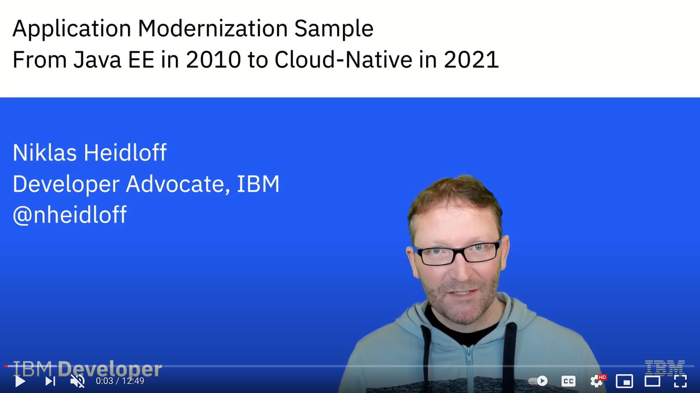

## Application Modernization Sample - From Java EE (2010) to Cloud-Native (2021)

Application modernization is done in multiple steps. This sample demonstrates how to modernize 10+ years old Java EE applications with cloud-native technologies like Quarkus and Open Liberty.

The following 12 minutes video describes the project on a high level:

<kbd>[](https://youtu.be/lw95LLqa37g)</kbd>

1. Monolith - WebSphere ND or Traditional 8.5.5
    - Starting point: Java EE 6 app from 2008 running in VM or bare metal
    - Db2 is used as data store
2. Monolith - WebSphere Traditional 9 in container
    - Application converted with Transformation Advisor without code changes    
3. Monolith - WebSphere Liberty (latest)
    - Application converted with Eclipse Migration Tools (and Transformation Advisor)
    - Same project structure and EJBs    
4. Separated Frontend - WebSphere Liberty (latest)
    - Dojo frontend in separate container
    - Backend and frontend connected via proxy
5. Separated Frontend - Open Liberty (latest)
    - Still same project structure and EJBs
6. Strangled Catalog Service and remaining Open Liberty Monolith
    - Strangled catalog service
        - Inspired by [Mono2Micro](mono2micro/READMDE.md)
        - Developed with Quarkus
        - Runs in JVM
        - Data is accessed in Postgres via Panache
        - Kafka events are sent when prices change
    - Remaining Open Liberty monolith
        - Modern project structure and CDI
        - Receives Kafka events when prices change and caches data
7. Strangled Catalog Service and remaining Quarkus Monolith
    - Strangled Quarkus catalog service 
        - Reactive endpoints and Postgres access
    - Remaining Quarkus monolith
        - Synchronous code
        - Runs as native executable
8. Micro frontend based web application
    - Developed with single-spa and Vue.js
    - Split in six containers
    - Messaging done via RxJS
    - Material design

Screenshot of legacy storefront application:

<kbd></kbd>

Screenshot of modernized storefront application:

<kbd></kbd>


### TL;DR

If you want to run the modernized application locally, you can invoke the following commands. All you need is a local Docker installation and the git CLI.

Notes:
* Docker requires 14 GB memory, 10 CPUs and 80 GB disk space
* It takes roughly 15 - 20 minutes to start everything
* Make sure docker-compose is also installed (sounds like this needs to be installed separately on some systems)

```
$ git clone https://github.com/nheidloff/application-modernization-javaee-quarkus.git && cd application-modernization-javaee-quarkus
$ ROOT_FOLDER=$(pwd)
$ sh ${ROOT_FOLDER}/scripts-docker/build-and-run.sh
```

The 'build-and-run.sh' script will launch the following containers.

<kbd></kbd>

Once everything has been started, you can open the web applications:

* Legacy Dojo frontend: http://localhost/CustomerOrderServicesWeb
* Modern micro-frontend based application: http://localhost:8080

Add the item "Return of the Jedi" to the shopping cart via drag and drop.

<kbd></kbd>

Update the price of this item:

```
$ curl -X PUT "http://localhost/CustomerOrderServicesWeb/jaxrs/Product/1" -H "accept: application/json" -H "Content-Type: application/json" -d "{\"id\":1, \"price\":50}"
```

Open the "Order History" tab to see the updated price. The new price has been updated in the catalog service and the remaining monolith.

<kbd></kbd>


### Documentation

I've written a series of blogs about this project:

* [Project Overview Video](http://heidloff.net/article/video-application-modernization-in-baby-steps/) (12 mins)
* [Project Teaser Video](https://youtu.be/evhQ7BslMeU) (2 mins)
* Rabbit video: [Application Modernization and Rabbits](http://heidloff.net/articles/application-modernization-and-rabbits/)
* Recording from WeAreDevelopers: [Application Modernization and Rabbits](https://vimeo.com/wearedevelopers/download/528262363/171975e79d) (30 mins)
* [Project Overview Slides](documentation/AppModernization.pdf)
* [10 Reasons why Enterprises should modernize Applications](http://heidloff.net/article/ten-reasons-why-enterprises-should-modernize-applications/)
* [Improving operational Efficiency through Application Modernization](http://heidloff.net/article/improving-operational-efficiency-through-application-modernization/)
* [Modernizing Java EE Applications with WebSphere Liberty](http://heidloff.net/article/modernizing-java-ee-applications-with-websphere-liberty/)
* [Step-by-Step Instructions how to use Transformation Advisor](http://heidloff.net/article/step-by-step-instructions-ibm-transformation-advisor/)
* [Modernizing Applications with new User Experiences](http://heidloff.net/article/modernizing-applications-with-new-user-experiences/)
* [Moving from WebSphere Liberty to Open Source with Open Liberty](http://heidloff.net/article/modernizing-websphere-liberty-applications-with-open-liberty/)
* [Increasing Productivity for legacy Liberty Applications](http://heidloff.net/article/increasing-developer-productivity-for-legacy-liberty-applications/)
* [Don’t build distributed Monoliths!](http://heidloff.net/article/do-not-build-distributed-monoliths/)
* [Strangler Pattern Example](http://heidloff.net/article/strangler-pattern-example/)
* [Step-by-Step Instructions for Mono2Micro](http://heidloff.net/article/step-by-step-instructions-mono2micro/)
* [Event driven Architectures for loosely coupled Microservices](http://heidloff.net/article/event-driven-architectures-loosely-coupled-microservices/)
* [Using Quarkus for building reactive Applications](http://heidloff.net/article/using-quarkus-reactive-applications)
* [Using Micro Frontends in Microservices based Architectures](http://heidloff.net/article/using-micro-frontends-microservices/)
* [Developing Micro Frontends with Single-Spa](http://heidloff.net/article/developing-micro-frontends-single-spa/)
* [Developing loosely coupled Micro Frontends via RxJS](http://heidloff.net/article/developing-loosely-coupled-micro-frontends-rxjs/)
* [Workshop: Modernizing IBM WebSphere Applications](http://heidloff.net/article/workshop-modernizing-ibm-websphere-applications/)
* [Running Liberty Applications with Db2 locally](http://heidloff.net/article/running-liberty-applications-with-db2-locally/)
* [Running legacy Java Applications locally](http://heidloff.net/article/running-legacy-java-applications-locally/)
* [Application Modernization Resources on IBM Developer](http://heidloff.net/article/application-modernization-resources-on-ibm-developer/)
* [IBM Garage Application Modernization Playbook](https://ibm-cloud-architecture.github.io/modernization-playbook/applications/refactor/)


### Monolith - WebSphere Liberty

```
$ git clone https://github.com/nheidloff/application-modernization-javaee-quarkus.git && cd application-modernization-javaee-quarkus
$ ROOT_FOLDER=$(pwd)
$ sh ${ROOT_FOLDER}/scripts-docker/build-and-run-monolith-db2.sh
$ sh ${ROOT_FOLDER}/scripts-docker/build-and-run-monolith-app.sh
```

Open http://localhost/CustomerOrderServicesWeb


### Separated Frontend - WebSphere Liberty

```
$ git clone https://github.com/nheidloff/application-modernization-javaee-quarkus.git && cd application-modernization-javaee-quarkus
$ ROOT_FOLDER=$(pwd)
$ sh ${ROOT_FOLDER}/scripts-docker/build-and-run-monolith-db2.sh
$ sh ${ROOT_FOLDER}/scripts-docker/build-and-run-splitted-frontend.sh
```

Open http://localhost/CustomerOrderServicesWeb


### Separated Frontend - Open Liberty (EJB)

```
$ git clone https://github.com/nheidloff/application-modernization-javaee-quarkus.git && cd application-modernization-javaee-quarkus
$ ROOT_FOLDER=$(pwd)
$ sh ${ROOT_FOLDER}/scripts-docker/build-and-run-monolith-db2.sh
$ sh ${ROOT_FOLDER}/scripts-docker/build-and-run-splitted-frontend-open.sh
```

Open http://localhost/CustomerOrderServicesWeb


### Strangled Catalog Service with Open Liberty (CDI)

```
$ git clone https://github.com/nheidloff/application-modernization-javaee-quarkus.git && cd application-modernization-javaee-quarkus
$ ROOT_FOLDER=$(pwd)
$ sh ${ROOT_FOLDER}/scripts-docker/build-and-run-monolith-db2.sh
$ sh ${ROOT_FOLDER}/scripts-docker/run-database-postgres-catalog.sh
$ sh ${ROOT_FOLDER}/scripts-docker/run-kafka.sh
$ sh ${ROOT_FOLDER}/scripts-docker/build-and-run-catalog.sh
```

Open http://localhost/CustomerOrderServicesWeb

Add the item "Return of the Jedi" to the shopping cart and update the price.


*Local Development - Catalog*

Change the Postgres and Kafka URLs in application.properties. Plus change KAFKA_ADVERTISED_LISTENERS in docker-compose-kafka.yml.

```
$ cd catalog
$ mvn quarkus:dev
```

*Local Development - Open Liberty (CDI)*

Change the Kafka URL in microprofile-config.properties. Change database host and driver location in server.xml.

```
$ cd monolith-open-liberty-cloud-native
$ mvn liberty:dev
```


### Strangled Catalog Service with Quarkus

```
$ sh ${ROOT_FOLDER}/scripts-docker/build-and-run-monolith-db2.sh
$ sh ${ROOT_FOLDER}/scripts-docker/run-database-postgres-catalog.sh
$ sh ${ROOT_FOLDER}/scripts-docker/run-kafka.sh
$ sh ${ROOT_FOLDER}/scripts-docker/build-and-run-all-quarkus.sh
```

Open http://localhost/CustomerOrderServicesWeb

Add the item "Return of the Jedi" to the shopping cart and update the price.


### Micro-Frontend based Web Application

In addition to the previous commands run this command:

```
$ sh ${ROOT_FOLDER}/scripts-docker/build-and-run-single-spa.sh
```

Open http://localhost:8080


### Monolith - WebSphere Traditional 9.0

The following scripts launch the application in a container. However the application doesn't connect to the database yet.

```
$ sh scripts/install-dojo.sh
$ sh scripts/install-was-dependencies.sh
$ sh scripts-docker/build-and-run-monolith-app-was90.sh
```

Open https://localhost:9443/CustomerOrderServicesWeb/ (user: skywalker, password: force)

Open https://localhost:9043/ibm/console/login.do?action=secure (user: wsadmin, password: passw0rd)


### Monolith - WebSphere Traditional 8.5.5

The original version runs on bare metal (or in a virtual machine). Check the original [documentation](monolith-websphere-855/README.md) for setup instructions.

To simplify the setup, a container is used instead. Since the code in 'monolith-websphere-855' and 'monolith-websphere-90' is identical, similar commands as above can be executed:

```
$ sh scripts/install-dojo.sh
$ sh scripts/install-was-dependencies.sh
$ sh scripts-docker/build-and-run-monolith-app-was855.sh
```

Open https://localhost:9443/CustomerOrderServicesWeb/ (user: skywalker, password: force)

Open https://localhost:9043/ibm/console/login.do?action=secure (user: wsadmin, password: passw0rd)


### Deployment to OpenShift on IBM Cloud (ROKS)

```
$ oc login ...
$ sh scripts-openshift/check-prerequisites.sh
$ sh scripts-openshift/deploy-db2.sh
$ sh scripts-openshift/deploy-kafka.sh
$ sh scripts-openshift/deploy-monolith-open-liberty-cloud-native.sh
$ sh scripts-openshift/deploy-postgres.sh
$ sh scripts-openshift/deploy-service-catalog-quarkus-reactive.sh
$ sh scripts-openshift/deploy-frontend-dojo.sh
$ sh scripts-openshift/show-urls.sh
```