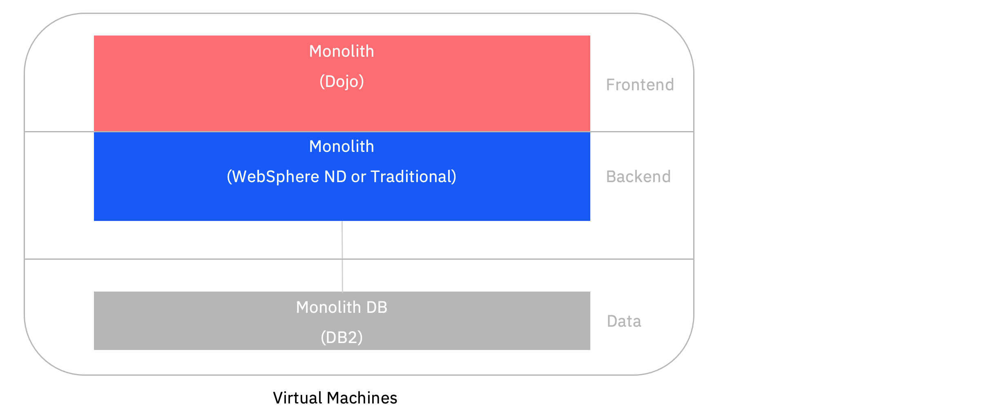
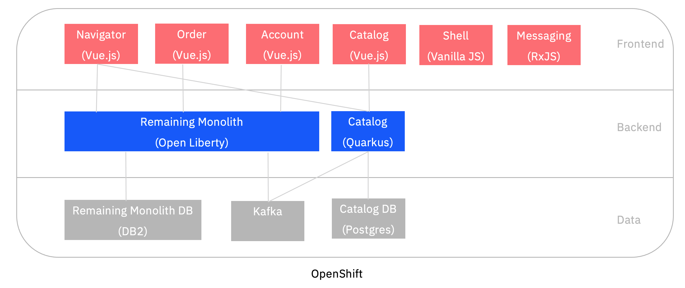

## Application Modernization Sample - From Java EE in 2010 to Cloud-Native in 2021

This sample demonstrates how to modernize 10+ year-old Java EE applications with cloud-native technologies and the modern Java runtimes Quarkus and Open Liberty. The modernized application is deployed to and operated with OpenShift, the enterprise distribution of Kubernetes.

The following 12 minutes video describes the project on a high level:

<kbd>[](https://youtu.be/lw95LLqa37g)</kbd>


### Demonstrated Capabilities, Technologies and Tools

Application modernization is a journey. The legacy application has been modernized in eight steps.

1. Monolith - WebSphere ND or Traditional 8.5.5
    - Starting point: Java EE 6 app from 2008 running in VM or bare metal
    - Db2 is used as data store
2. Monolith - WebSphere Traditional 9 in container
    - Application converted with Transformation Advisor without code changes    
3. Monolith - WebSphere Liberty (latest)
    - Application converted with Eclipse Migration Tools (and Transformation Advisor)
    - Same project structure and EJBs    
4. Separated Frontend - WebSphere Liberty (latest)
    - Dojo frontend in separate container
    - Backend and frontend connected via proxy
5. Separated Frontend - Open Liberty (latest)
    - Still same project structure and EJBs
6. Strangled Catalog Service and remaining Open Liberty Monolith
    - Strangled catalog service
        - Inspired by Mono2Micro
        - Developed with Quarkus
        - Runs in JVM
        - Data is accessed in Postgres via Panache
        - Kafka events are sent when prices change
    - Remaining Open Liberty monolith
        - Modern project structure and CDI
        - Receives Kafka events when prices change and caches data
7. Strangled Catalog Service and remaining Quarkus Monolith
    - Strangled Quarkus catalog service 
        - Reactive endpoints and Postgres access
    - Remaining Quarkus monolith
        - Synchronous code
        - Runs as native executable
8. Micro frontend based web application
    - Developed with single-spa and Vue.js
    - Split in six containers
    - Messaging done via RxJS
    - Material design

Architecture of the legacy application:

<kbd></kbd>

Screenshot of legacy storefront application:

<kbd></kbd>

Architecture of the modernized application:

<kbd></kbd>

Screenshot of modernized storefront application:

<kbd></kbd>


### Documentation

I've written a series of blogs about this project:

* [Project Overview Video](http://heidloff.net/article/video-application-modernization-in-baby-steps/) (12 mins)
* [Project Teaser Video](https://youtu.be/evhQ7BslMeU) (2 mins)
* Rabbit video: [Application Modernization and Rabbits](http://heidloff.net/articles/application-modernization-and-rabbits/)
* Recording from WeAreDevelopers: [Application Modernization and Rabbits](https://vimeo.com/wearedevelopers/download/528262363/171975e79d) (30 mins)
* [Project Overview Slides](documentation/AppModernization.pdf)
* [10 Reasons why Enterprises should modernize Applications](http://heidloff.net/article/ten-reasons-why-enterprises-should-modernize-applications/)
* [Improving operational Efficiency through Application Modernization](http://heidloff.net/article/improving-operational-efficiency-through-application-modernization/)
* [Modernizing Java EE Applications with WebSphere Liberty](http://heidloff.net/article/modernizing-java-ee-applications-with-websphere-liberty/)
* [Step-by-Step Instructions how to use Transformation Advisor](http://heidloff.net/article/step-by-step-instructions-ibm-transformation-advisor/)
* [Modernizing Applications with new User Experiences](http://heidloff.net/article/modernizing-applications-with-new-user-experiences/)
* [Moving from WebSphere Liberty to Open Source with Open Liberty](http://heidloff.net/article/modernizing-websphere-liberty-applications-with-open-liberty/)
* [Increasing Productivity for legacy Liberty Applications](http://heidloff.net/article/increasing-developer-productivity-for-legacy-liberty-applications/)
* [Don’t build distributed Monoliths!](http://heidloff.net/article/do-not-build-distributed-monoliths/)
* [Strangler Pattern Example](http://heidloff.net/article/strangler-pattern-example/)
* [Step-by-Step Instructions for Mono2Micro](http://heidloff.net/article/step-by-step-instructions-mono2micro/)
* [Event driven Architectures for loosely coupled Microservices](http://heidloff.net/article/event-driven-architectures-loosely-coupled-microservices/)
* [Using Quarkus for building reactive Applications](http://heidloff.net/article/using-quarkus-reactive-applications)
* [Using Micro Frontends in Microservices based Architectures](http://heidloff.net/article/using-micro-frontends-microservices/)
* [Developing Micro Frontends with Single-Spa](http://heidloff.net/article/developing-micro-frontends-single-spa/)
* [Developing loosely coupled Micro Frontends via RxJS](http://heidloff.net/article/developing-loosely-coupled-micro-frontends-rxjs/)
* [Workshop: Modernizing IBM WebSphere Applications](http://heidloff.net/article/workshop-modernizing-ibm-websphere-applications/)
* [Running Liberty Applications with Db2 locally](http://heidloff.net/article/running-liberty-applications-with-db2-locally/)
* [Running legacy Java Applications locally](http://heidloff.net/article/running-legacy-java-applications-locally/)
* [Application Modernization Resources on IBM Developer](http://heidloff.net/article/application-modernization-resources-on-ibm-developer/)
* [IBM Garage Application Modernization Playbook](https://ibm-cloud-architecture.github.io/modernization-playbook/applications/refactor/)


### Deployment via Docker Desktop

If you want to run the modernized application locally, you can invoke the following commands. All you need is a local Docker installation and the git CLI.

Notes:
* Docker requires 14 GB memory, 10 CPUs and 80 GB disk space
* It takes roughly 15 - 20 minutes to start everything
* Make sure docker-compose is also installed (sounds like this needs to be installed separately on some systems)

```
$ git clone https://github.com/nheidloff/application-modernization-javaee-quarkus.git && cd application-modernization-javaee-quarkus
$ ROOT_FOLDER=$(pwd)
$ sh ${ROOT_FOLDER}/scripts-docker/build-and-run.sh
```

The 'build-and-run.sh' script will launch the following containers.

<kbd></kbd>

Once everything has been started, you can open the web applications:

* Legacy Dojo frontend: http://localhost/CustomerOrderServicesWeb
* Modern micro-frontend based application: http://localhost:8080

Add the item "Return of the Jedi" to the shopping cart via drag and drop.

<kbd></kbd>

Update the price of this item:

```
$ curl -X PUT "http://localhost/CustomerOrderServicesWeb/jaxrs/Product/1" -H "accept: application/json" -H "Content-Type: application/json" -d "{\"id\":1, \"price\":50}"
```

Open the "Order History" tab to see the updated price. The new price has been updated in the catalog service and the remaining monolith.

<kbd></kbd>


### Deployment to OpenShift on IBM Cloud (ROKS) with Tekton

The following scripts deploy the modernized application on Red Hat [OpenShift on IBM Cloud](https://cloud.ibm.com/kubernetes/overview?platformType=openshift). However the same instructions should work for other OpenShift and OCP deployments, for example [CodeReady Containers](https://developers.redhat.com/products/codeready-containers/overview).

First create an [IBM Cloud Account](https://cloud.ibm.com/registration). Then create an OpenShift cluster, for example via the [IBM Cloud Dashboard](https://cloud.ibm.com/kubernetes/catalog/create?platformType=openshift). I've tested classic infrastructure, single zone, OpenShift 4.6.17, b3c.8x32 and 3 worker nodes.

Additionally you need to install Tekton. The easiest option is to use the '[OpenShift Pipelines](https://docs.openshift.com/container-platform/4.6/pipelines/installing-pipelines.html)' operator from the OperatorHub view in the OpenShift Console ([screenshots](documentation/deploy-tekton-1.png)). Simply accept all defaults. No local installations are necessary.

```
$ git clone https://github.com/nheidloff/application-modernization-javaee-quarkus.git && cd application-modernization-javaee-quarkus
$ ROOT_FOLDER=$(pwd)
$ sh ${ROOT_FOLDER}/scripts-openshift-tekton/check-prerequisites.sh
$ oc login ...
$ sh ${ROOT_FOLDER}/scripts-openshift-tekton/deploy-db2.sh
$ sh ${ROOT_FOLDER}/scripts-openshift-tekton/deploy-kafka.sh
$ sh ${ROOT_FOLDER}/scripts-openshift-tekton/deploy-postgres.sh
$ sh ${ROOT_FOLDER}/scripts-openshift-tekton/deploy-application.sh
$ sh ${ROOT_FOLDER}/scripts-openshift-tekton/show-urls.sh
```


### Deployments of intermediate Versions

The separate [document](documentation/Deployments.md) describes how to deploy specific intermediate versions of the sample and how to run services locally.