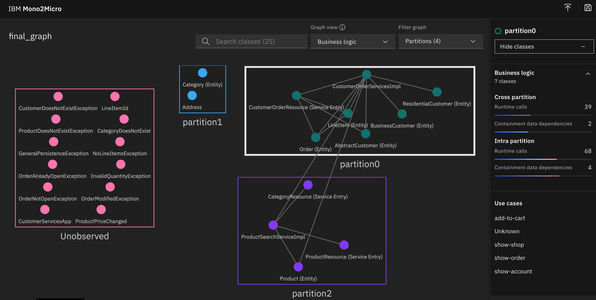

## Mono2Micro Instructions

Download Mono2Micro: http://ibm.biz/Mono2Micro 

Put three files in ${ROOT_FOLDER}/mono2micro/tool. Extract the two zip files.

```
$ docker run --rm -it -v ${ROOT_FOLDER}/:/var/application ibmcom/mono2micro-bluejay /var/application/monolith-open-liberty
$ cp ${ROOT_FOLDER}/monolith-open-liberty-klu/refTable.json ${ROOT_FOLDER}/mono2micro/output/tables
$ cp ${ROOT_FOLDER}/monolith-open-liberty-klu/symTable.json ${ROOT_FOLDER}/mono2micro/output/tables
```

```
$ sh ${ROOT_FOLDER}/scripts-docker/build-and-run-monolith-db2.sh
$ sh ${ROOT_FOLDER}/scripts-docker/build-and-run-splitted-frontend-open-klu.sh
```

Open http://localhost/CustomerOrderServicesWeb

```
$ cd ${ROOT_FOLDER}/mono2micro/tool/Mono2Micro-Monolith-DataCollector/Flicker
$ java -cp commons-net-3.6.jar:json-simple-1.1.jar:. Flicker -no_ntp -a context.json
```

Enter <Label> to start recording current context (type "Exit" to quit).  
show-shop  
Enter STOP to terminate the recording of the current context.  
STOP  

Enter <Label> to start recording current context (type "Exit" to quit).  
change-category  
Enter STOP to terminate the recording of the current context.  
STOP 

Enter <Label> to start recording current context (type "Exit" to quit).  
add-to-cart  
Enter STOP to terminate the recording of the current context.  
STOP  

Enter <Label> to start recording current context (type "Exit" to quit).  
show-order  
Enter STOP to terminate the recording of the current context.  
STOP  

Enter <Label> to start recording current context (type "Exit" to quit).  
show-account  
Enter STOP to terminate the recording of the current context.  
STOP
     
Enter <Label> to start recording current context (type "Exit" to quit).  
exit

```
$ cp ${ROOT_FOLDER}/mono2micro/tool/Mono2Micro-Monolith-DataCollector/Flicker/context.json ${ROOT_FOLDER}/mono2micro/output/contexts
$ docker cp storefront-backend-open:/logs/messages.log .
$ cp messages.log ${ROOT_FOLDER}/mono2micro/output/logs
```

```
$ docker run --rm -it -v ${ROOT_FOLDER}/mono2micro/output:/var/application ibmcom/mono2micro-aipl
```

```
$ docker run -d -p 3000:3000 ibmcom/mono2micro-ui
```

Open http://localhost:3000 and add ${ROOT_FOLDER}/mono2micro/output/mono2micro-output/oriole/final_graph.json

<kbd></kbd>

### Results

The purple rectangle is essentially the catalog service (except of the missing Category class).

The green classes make up the remaining monolith (except of Address).

The red classes need to be assigned to either the catalog service of the remaining monolith dependent of class dependencies. Most of them are exceptions which weren't covered in the use cases.

### Code Generation

```
$ cp ${ROOT_FOLDER}/monolith-open-liberty ${ROOT_FOLDER}/mono2micro/output/mono2micro/mono2micro-output
$ docker run --rm -it -v ${ROOT_FOLDER}/mono2micro/output/mono2micro/mono2micro-output:/var/cardinal ibmcom/mono2micro-cardinal /var/cardinal/monolith-open-liberty /var/cardinal/cardinal
```

### Questions

1. Why does the natural seams view not show 3 but only 2 partitions? Why is the catalog service not shown here as candidate for the strangler pattern?

2. How can you move the Address and Category objects in the two other partitions? Same for unused objects. And why is there no relation to these two objects from the other two partitions/services?

3. Where can you see where in CustomerOrderServiceImpl ProductSearchServiceImpl is invoked? Why are there two arrows? Why not one that shows the actual network traffic?

4. Why isn't MicroProfile REST client used in the generated code?

5. Why is unused code/classes still in the generated code?

6. Where are the Dockerfiles?

