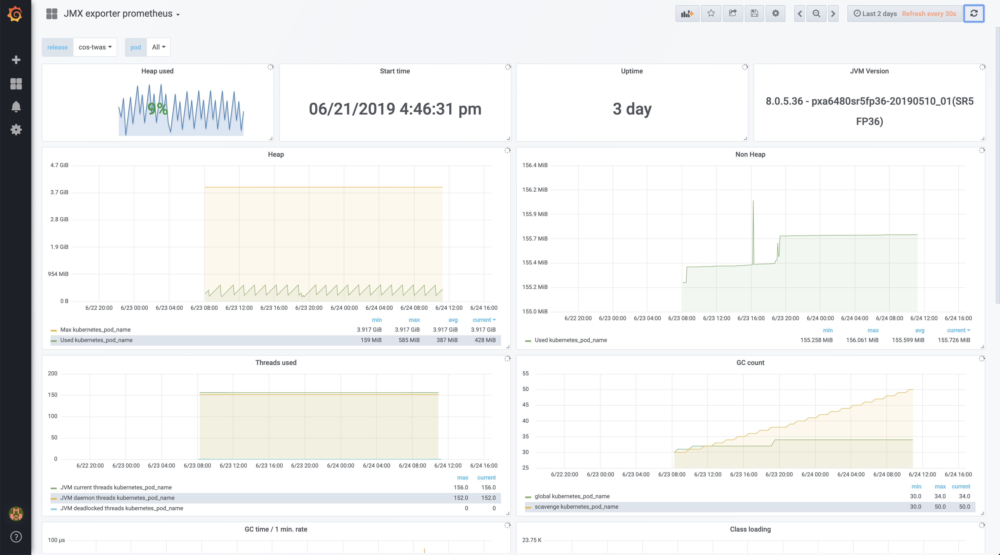

# Prometheus JMX exporter for tWAS

This readme highlights the work needed in order to add the Prometheus JMX exporter to your tWAS docker image so that you can get JVM metrics in your ICP Grafana dashboard. The official Prometheus JMX exporter repository can be found [here](https://github.com/prometheus/jmx_exporter). This exporter is intended to be run as a Java Agent, exposing a HTTP server and serving metrics of the local JVM.

This work should proceed the work done in [here](https://github.ibm.com/CASE/cloudpak-for-applications/blob/master/tWAS-build.md) for modernising a traditional WebSphere application to run in traditional WebSphere in containers in ICP. Thus, you must complete that work before doing what is outlined here.

## Docker image

In order to build a new docker image with the Prometheus JMX exporter, we need to add the actual library and its configuration to the docker image by adding the following to your Dockerfile:

```
COPY --chown=was:0 <local_path>/jmx_prometheus_javaagent-0.11.0.jar /opt/IBM/jmx_exporter/
COPY --chown=was:0 <local_path>/jmx-config.yaml /opt/IBM/jmx_exporter/
```

where `<local_path>` is the path where you downloaded the library and `/opt/IBM/jmx_exporter/` is just an example of where you could place these two files within your container.

### Local testing

In order to test your new image locally, you need to provide the `jvm.props` for WebSphere to load these up at startup time and therefore set this Prometheus JMX exporter as a Java Agent. Hence, create a `jvm.props` file with the following:


```
ResourceType=JavaVirtualMachine
ImplementingResourceType=Server
ResourceId=Cell=!{cellName}:Node=!{nodeName}:Server=!{serverName}:JavaProcessDef=:JavaVirtualMachine=
AttributeInfo=jvmEntries
genericJvmArguments=-javaagent:/opt/IBM/jmx_exporter/jmx_prometheus_javaagent-0.11.0.jar=9082:/opt/IBM/jmx_exporter/jmx-config.yaml

```

where, again, `/opt/IBM/jmx_exporter/` is the place we chose to place the Prometheus JMX exporter library and config files at and **9082** is just a random port we have chosen to get the metrics exported to for Prometheus to scrape them.

With that `jvm.props` created, you need to add this to your Dockerfile:

```
#COPY --chown=was:0 <local_path>/jvm.props /work/config
#RUN /work/configure.sh
```

where `<local_path>` is the path where you created the `jvm.props`, `/work/config` the location where you place the properties files you want WebSphere to pick up at start up time and `/work/configure.sh` the script you need to run in order to configure WebSphere with those properties. For more info see the official tWAS container documentation [here](https://github.com/WASdev/ci.docker.websphere-traditional)

## Build and push docker image

To build your docker image that now includes the Prometheus JMX exporter, just issue the following command:

```
docker build --tag <image>:<tag> --build-arg PASSWORD=<was_admin_password> .
```

Re-tag this newly created docker image and push it down to your ICP docker image registry by executing the following commands:

```
docker tag <image>:<tag> <icp_cluster_CA_domain>:8500/<namespace>/<image>:<tag>
docker push <icp_cluster_CA_domain>:8500/<namespace>/<image>:<tag>
```

For more information about pushing images to ICP docker image registry read the official documentation [here](https://www.ibm.com/support/knowledgecenter/en/SSBS6K_3.2.0/manage_images/using_docker_cli.html)


## Run your image in ICP

### jvm properties

In order to run your tWAS docker image that contains your application, we first need inject the `jvm.props` dynamically by defining them in a configmap:

```
apiVersion: v1
kind: ConfigMap
metadata:
  name: jvm-configmap
data:
  jvm.props: |-
    # Prometheus JMX exporter
    ResourceType=JavaVirtualMachine
    ImplementingResourceType=Server
    ResourceId=Cell=!{cellName}:Node=!{nodeName}:Server=!{serverName}:JavaProcessDef=:JavaVirtualMachine=
    AttributeInfo=jvmEntries
    genericJvmArguments=-javaagent:/opt/IBM/jmx_exporter/jmx_prometheus_javaagent-0.11.0.jar=9082:/opt/IBM/jmx_exporter/jmx-config.yaml
```

Create the configmap by executing:

```
kubectl create -f <name_for_your_configmap>.yaml
```

More information in the helm chart official documentation [here](https://github.com/IBM/charts/tree/master/stable/ibm-websphere-traditional#configure-environment-using-configuration-properties)

### Deploy you helm chart

You are now ready to deploy the traditional WebSphere helm chart that will deploy your application. For more information, read the official documentation [here](https://github.com/IBM/charts/tree/master/stable/ibm-websphere-traditional#install-the-helm-chart).

In our case, we have deployed the application by

1. Adding the ibm helm repository to our local workstation
    ```
    helm repo add stable https://raw.githubusercontent.com/IBM/charts/master/repo/stable
    ```
2. Installing the traditional WebSphere helm chart
    ```
    helm upgrade --install <release_name> --namespace cos ibm-charts/ibm-websphere-traditional -f values.yaml --tls
    ```

where our `values.yaml` looks like:

```
image:
  repository: <icp_cluster_CA_domain>:8500/<namespace>/<image>
  tag: <tag>

ingress:
  enabled: true

configProperties:
  configMapName: "jvm-configmap"
```

You should now be able to access your application through your ICP cluster ingress.

## Configure Prometheus

In order to get the metrics of your recently deployed application we need to do two things. Expose the Prometheus JMX exporter and load a Grafana dashboard to see the metrics.

### Expose the Prometheus JMX exporter

In order to expose the metrics the Prometheus JMX exporter grabs from your application to the Prometheus that runs in ICP

1. Create a new port in the service your helm chart installation created before that opens the port you specified in the javaagent command in your `jvm.props`. In our case it is **9082**.
2. Add the following annotations to this server so that Prometheus scrapes the metrics:
    ```
    annotations:
      prometheus.io/scheme: "http"
      prometheus.io/scrape: "true"
    ```

Use the `Kubectl edit service <name_of_the_service>` command to add the modify your service accordingly. Our service looks like this:

```
apiVersion: v1
kind: Service
metadata:
  annotations:
    prometheus.io/scheme: http
    prometheus.io/scrape: "true"
  creationTimestamp: 2019-06-19T10:03:53Z
  labels:
    app: cos-twas-ibm-websphere-t
    chart: ibm-websphere-traditional-1.2.0
    heritage: Tiller
    release: cos-twas
  name: cos-twas-ibm-websphere-t
  namespace: cos
  resourceVersion: "14039309"
  selfLink: /api/v1/namespaces/cos/services/cos-twas-ibm-websphere-t
  uid: 8af0528b-9279-11e9-8940-005056a59e1a
spec:
  clusterIP: 10.10.10.254
  externalTrafficPolicy: Cluster
  ports:
  - name: https-was
    port: 9443
    protocol: TCP
    targetPort: 9443
  - name: http
    port: 9082
    protocol: TCP
    targetPort: 9082
  selector:
    app: cos-twas-ibm-websphere-t
  sessionAffinity: None
  type: ClusterIP
status:
  loadBalancer: {}
```

### Configure Grafana

Download the Grafana dashboard configured to display the Prometheus JMX exporter metrics [here](https://grafana.com/dashboards/7727) and import it into your ICP cluster Grafana instance. Once you do that, you should see that dashboard and in the top left corner a dropdown menu to select your application.


